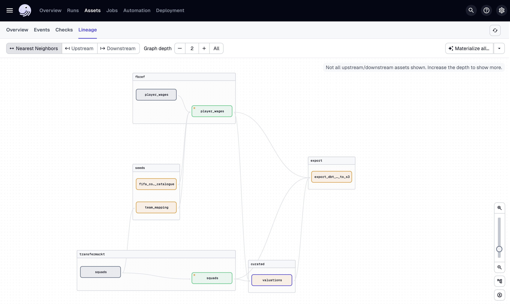

# Football Data Warehouse

## Overview

This project is intended as a data warehouse for football data from various sources.

There are currently two sources of data:

- `Fbref`
- `Transfermarkt`

Essentially, public data is parsed from these two sources using the [football-data-extractor](https://github.com/chonalchendo/football-data-extractor) repository,
cleaned using `dbt` and `Duckdb`,and stored locally in `Duckdb` which acts as a local data warehouse. Both raw and processed
datasets are also stored in an Amazon S3 bucket.

The data pipeline is automated using `Dagster`.

## Setup

To setup the project in your local environment, follow the steps below:

1. Clone the repository

```bash
git clone https://github.com/chonalchendo/football-data-warehouse.git
```

2. Install uv for package management

```bash
pip install uv
```

3. Setup the virtual environment

```bash
uv venv --python 3.12
```

4. Install the required packages from `pyproject.toml`

```bash
uv sync
```

4. Activate virtual environment if not already activated

```bash
source .venv/bin/activate
```

## Running the pipeline

There are a few ways to run the data pipeline that will populate `Duckdb` with data from the sources mentioned above.

To house many of the commands that are used to run the pipeline, a `Makefile` has been created. You can view the commands
either by simply looking inside the `Makefile` or by running the command below:

```bash
make help
```

This will output the following:

```bash
Available commands:
  make dagster-dev             : Run dagster dev server
  make dagster-run-asset       : Materialise a specific dagster asset
  make dagster-asset-partition : Materialise a specific dagster asset partition
  make dagster-job-partitions  : Run a specific dagster job with partitions
  make dbt-build               : Run pipeline for dbt assets
  make dbt-compile             : Compile dbt models
```

### Using the Dagster UI

This is a good way to visualise the pipeline and to see what assets (datasets) are being produced at each step.
You can also view the jobs that are created to manage different parts of the pipeline for example, `fbref_stats_job` is dedicated
to extracting and cleaning the `fbref` player statistics datasets such as player shooting and passing stats.

To run the pipeline using the Dagster UI, run the command below:

```bash
make dagster-dev
```

This will start the Dagster server and you can view the UI by navigating to `http://localhost:3000`.

Here is an example of what the Dagster UI looks like:


This image shows the flow of data to create the `valuations` dataset before exporting to Amazon S3.

You can run this pipeline by selecting `Materialize all` in the top right corner.

### Using the command line

To run assets or jobs from command line, you first have to check assets and jobs are available. You can check
by referring the `Assets` and `Jobs` section in the `Dagster` UI.

To run a specific asset run the following:

```bash
make dagster-run-asset ASSET=<asset_name>
```

Replace `<asset_name>` with the name of the asset you want to run.

To run a specific asset partition run the following:

```bash
make dagster-asset-partition ASSET=<asset_name> SEASON=<season>
```

Replace `<asset_name>` with the name of the asset you want to run and `<season>` is the season you would like to scrape or process data for.

For example, you could run:

```bash
make dagster-asset-partition ASSET=raw_player_passing SEASON=2022
```

This command would run the `raw_player_passing` asset for the `2022-2023` season.

You can also run a specific job with partitions using the following command:

```bash
make dagster-job-partitions JOB=<job_name> SEASON=<season>
```

An example of this is:

```bash
make dagster-job-partitions JOB=fbref_stats_job SEASON=2024
```

### Using dbt

By default, any raw assets parsed using the `football-data-extractor` are stored in the `data/raw` directory.
If you would just like to run the processing pipeline, you can use dbt which will materialise the processed
assets into `Duckdb`.

To do this, use the following command:

```bash
make dbt-build
```

## Accessing the data

The data is stored in `Duckdb` which is a lightweight, in-memory, OLAP database which is great for local development and
acts as a local data warehouse.

To access data parsed and processed by the pipeline, there are two options:

1. you can use the `Duckdb` CLI.

```bash
duckdb dbt/duckdb/database.db -c 'select * from valuations'
```

2. you can use the `Duckdb` Python API.

Using the Duckdb Python API, you can convert the data to a `pandas` or `polars` DataFrame depending on which package you perfer for further analysis.

```python
import duckdb

conn = duckdb.connect('dbt/duckdb/database.db')

# run a query and return the result
conn.sql('select * from valuations')

# convert to pandas
df = conn.sql('select * from valuations').df()

# convert to polars
df = conn.sql('select * from valuations').pl()
```

## Data Sources

### Fbref

`Fbref` is a website that provides detailed football statistics such as player shooting and passing stats. The data is taken from tables such as the ones found [here](https://fbref.com/en/comps/Big5/defense/players/Big-5-European-Leagues-Stats#stats_defense)

### Transfermarkt

`Tranfermarkt` is a well-known football website that provides great data on player market valuations, transfers, and match statistics. The data is taken from tables such as the ones found [here](https://www.transfermarkt.co.uk/tottenham-hotspur/kader/verein/148/saison_id/2021/plus/1)

## Infrastructure

All cloud based infrastructure is managed using `Terraform`. The infrastructure is defined in the `infra` directory. Currently, there is no read access to the S3 bucket for public consumption. This is something that will be added in the future.

## Future Work

- Add more data sources such as `Understat` and `Sofascore`
- Add more data processing steps such as feature engineering and data visualisation
- Pushlish data sources to a public S3 bucket for easy access
- Publish to public data areas such as `Kaggle`
