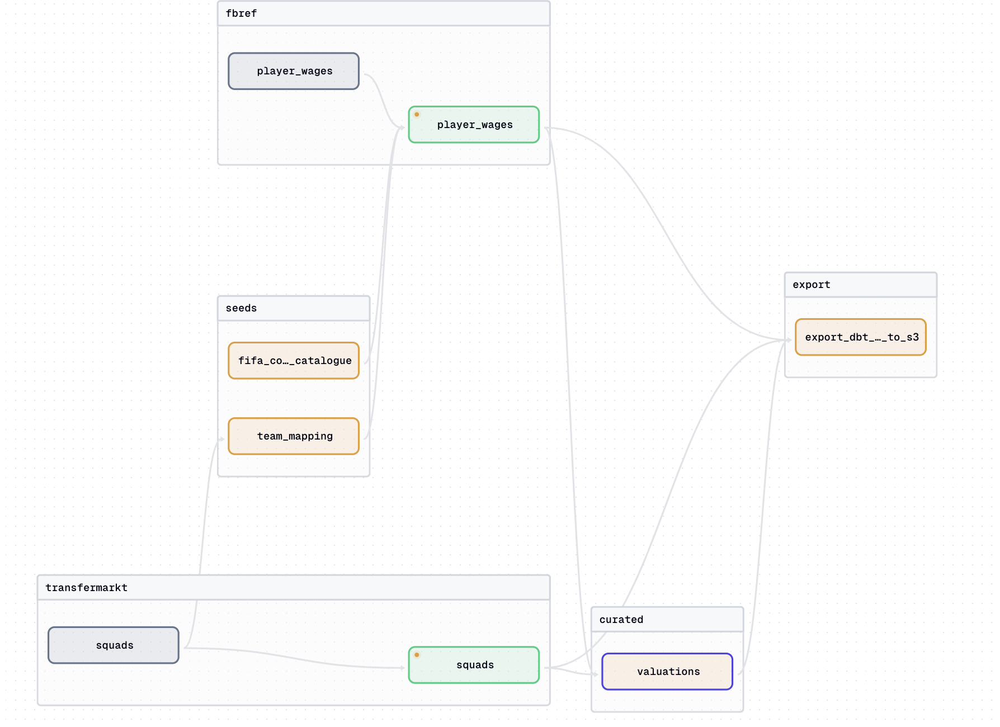

# Data Football Warehouse

## Overview

This project is intended as a data warehouse for football data from various sources.

There are currently two sources of data:

- `Fbref`
- `Transfermarkt`

Essentially, public data is parsed from these two sources using the [football-data-extractor](https://github.com/chonalchendo/football-data-extractor) repository,
cleaned using `dbt` and `Duckdb`,and stored locally in `Duckdb` which acts as a local data warehouse. Both raw and processed
datasets are also stored in an Amazon S3 bucket.

The data pipeline is automated using `Dagster`.

## Setup

To setup the project in your local environment, follow the steps below:

1. Clone the repository

```bash
git clone https://github.com/chonalchendo/football-data-warehouse.git
```

2. Install uv for package management

```bash
pip install uv
```

3. Install the required packages using `uv install`

```bash
uv install
```

4. Activate virtual environment

```bash
source .venv/bin/activate
```

## Running the pipeline

There are a few ways to run the data pipeline that will populate `Duckdb` with data from the sources mentioned above.

To house many of the commands that are used to run the pipeline, a `Makefile` has been created. You can view the commands
either by simply looking inside the `Makefile` or by running the command below:

```bash
make help
```

```bash
Available commands:
  make dagster-dev             : Run dagster dev server
  make dagster-run-asset       : Materialise a specific dagster asset
  make dagster-asset-partition : Materialise a specific dagster asset partition
  make dagster-job-partitions  : Run a specific dagster job with partitions
  make dbt-build               : Run pipeline for dbt assets
  make dbt-compile             : Compile dbt models
```

### Using the Dagster UI

This is a good way to visualise the pipeline and to see what assets (datasets) are being produced at each step.
You can also view the jobs that are created to manage different parts of the pipeline for example, `fbref_stats_job` is dedicated
to extracting and cleaning the `fbref` player statistics datasets such as player shooting and passing stats.

To run the pipeline using the Dagster UI, run the command below:

```bash
make dagster-dev
```

This will start the Dagster server and you can view the UI by navigating to `http://localhost:3000`.

Here is an example of what the Dagster UI looks like:


This image shows the flow of data to create the `valuations` dataset before exporting to Amazon S3.
